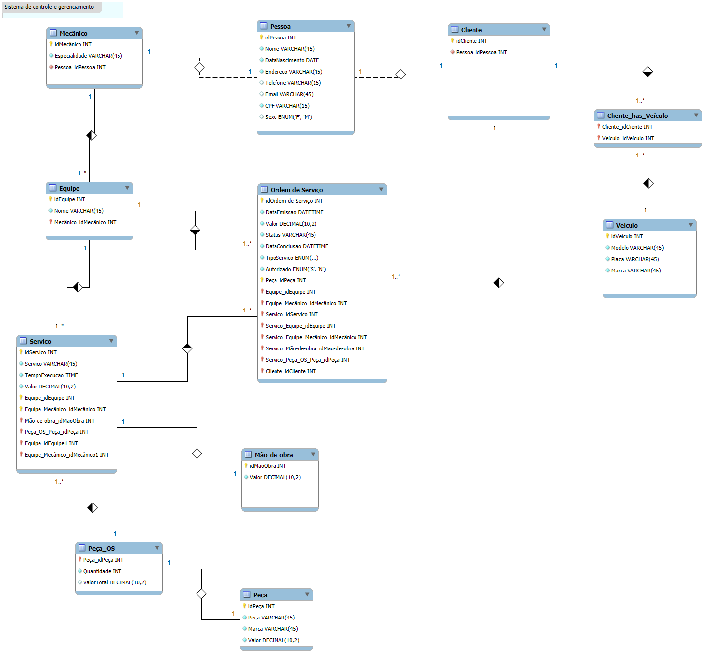

# 📋 Sistema de Controle e Gerenciamento - Oficina Mecânica

Este projeto tem como objetivo modelar e estruturar um banco de dados relacional para um sistema de controle e gerenciamento de ordens de serviço de uma oficina mecânica. O sistema contempla o cadastro de clientes, veículos, mecânicos, equipes, peças, serviços e o gerenciamento completo das ordens de serviço.

---

## 🧠 Modelo Conceitual (ER)

O modelo conceitual foi elaborado com base no diagrama entidade-relacionamento (ER) a seguir, que define todas as entidades, relacionamentos, cardinalidades e atributos necessários para o funcionamento do sistema:

---

## 📂 Tabelas Principais

- `Pessoa`: Dados genéricos de pessoas físicas (clientes e mecânicos)
- `Cliente`: Extensão da entidade pessoa
- `Mecânico`: Extensão da entidade pessoa com especialidade
- `Veículo`: Dados dos veículos associados aos clientes
- `Cliente_has_Veiculo`: Relacionamento N:N entre cliente e veículo
- `Equipe`: Agrupamento de mecânicos
- `Peça` e `Peça_OS`: Controle de peças e suas quantidades nas OS
- `Mão de Obra`: Custos aplicados aos serviços
- `Serviço`: Serviços oferecidos pela oficina
- `Ordem de Serviço`: Registro completo do atendimento realizado

---

## 👨‍💻 Autor

Desenvolvido como projeto acadêmico/profissional para estudos de modelagem de dados e práticas de banco de dados relacionais com MySQL.

---

## 📝 Licença

Este projeto está licenciado sob a licença MIT. Sinta-se à vontade para usá-lo, modificá-lo e compartilhá-lo.

